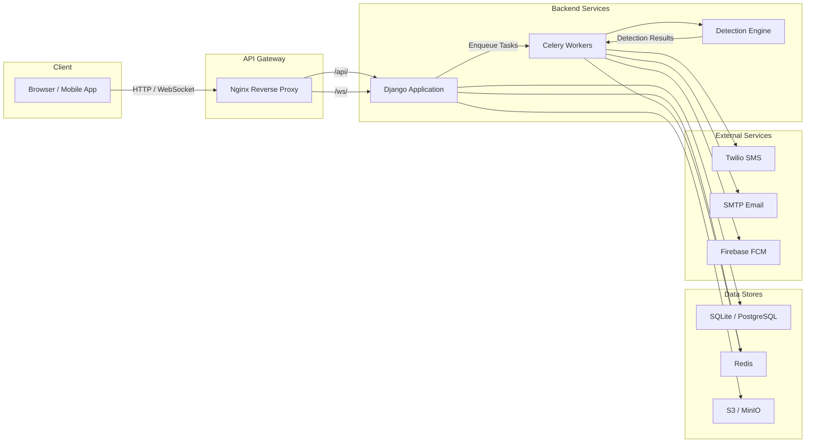
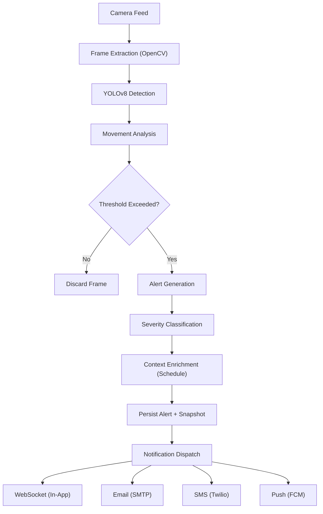
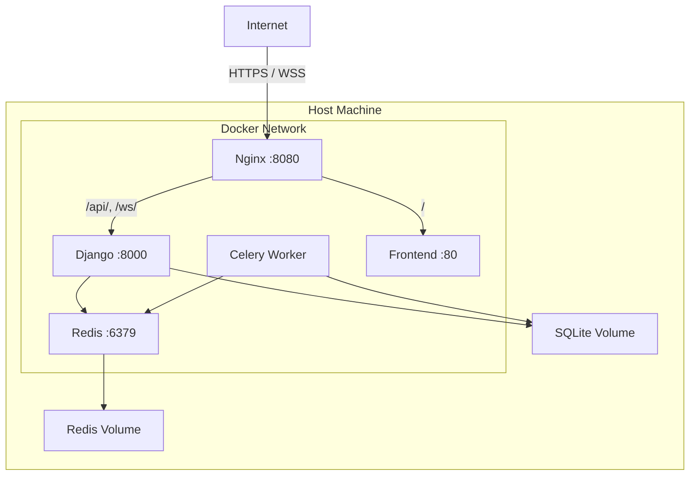

# Architecture

This document describes the high-level architecture of ClassGuard, covering system components, data flow, technology choices, security design, and deployment topology.

---

## Table of Contents

- [System Overview](#system-overview)
- [Component Descriptions](#component-descriptions)
- [Data Flow](#data-flow)
- [Technology Choices and Rationale](#technology-choices-and-rationale)
- [Security Architecture](#security-architecture)
- [Deployment Architecture](#deployment-architecture)

---

## System Overview

---

## Component Descriptions

### Detection Engine

The Detection Engine is the core intelligence layer responsible for analyzing camera feeds and identifying security-relevant events.

- **Frame Extraction** -- OpenCV captures frames from RTSP or HTTP camera streams at a configurable interval (default: 2 fps).
- **Object Detection** -- Ultralytics YOLOv8 runs inference on each frame to identify people, objects, and anomalies.
- **Movement Analysis** -- A custom scoring algorithm evaluates detected objects across consecutive frames to determine movement patterns, loitering, unauthorized zone entry, and crowd density.
- **Confidence Thresholds** -- Configurable per-camera thresholds control sensitivity. Only detections exceeding the threshold trigger downstream processing.

### Alert Pipeline

The Alert Pipeline transforms raw detections into actionable alerts.

1. **Aggregation** -- Raw detections within a sliding time window are grouped to prevent duplicate alerts for a single ongoing event.
2. **Severity Classification** -- Each aggregated event is assigned a severity level (low, medium, high, critical) based on detection confidence, zone sensitivity, and time-of-day context.
3. **Context Enrichment** -- The pipeline cross-references the class schedule to determine whether detected activity is expected (e.g., students in a hallway during break vs. during class).
4. **Persistence** -- Validated alerts are persisted to the database with associated snapshots stored in S3/MinIO.

### Notification System

The Notification System delivers alerts to the appropriate recipients through multiple channels.

| Channel    | Provider   | Use Case                                     |
| ---------- | ---------- | -------------------------------------------- |
| In-App     | WebSocket  | Real-time dashboard updates                  |
| Email      | SMTP       | Detailed alert reports with snapshots         |
| SMS        | Twilio     | Critical alerts requiring immediate attention |
| Push       | FCM        | Mobile app notifications                      |

Notification routing is role-based:

- **Teachers** -- Receive alerts for their assigned classrooms and common areas.
- **Principals** -- Receive all alerts above a configurable severity threshold.
- **Parents** -- Receive alerts involving their registered children (opt-in).

---

## Data Flow

The end-to-end data flow from camera input to notification delivery:

### Step-by-Step

1. **Camera** -- IP cameras stream video via RTSP or HTTP to the backend.
2. **Frame Extraction** -- OpenCV reads frames at a configured sample rate and converts them to NumPy arrays.
3. **YOLO Detection** -- Each frame is passed through a pre-trained YOLOv8 model. Bounding boxes, class labels, and confidence scores are returned.
4. **Movement Analysis** -- Consecutive frame detections are correlated to compute movement vectors, dwell times, and zone violations.
5. **Alert Generation** -- Events exceeding configured thresholds produce an alert object containing the detection metadata, timestamp, camera ID, and a snapshot image.
6. **Notification Dispatch** -- Celery tasks fan out notifications to all relevant channels based on the alert severity and recipient preferences.

---

## Technology Choices and Rationale

| Component        | Choice              | Rationale                                                                                       |
| ---------------- | ------------------- | ----------------------------------------------------------------------------------------------- |
| Web Framework    | Django & DRF        | Robust ORM, built-in Admin panel, mature REST API framework                     |
| Frontend         | React + Vite        | Component-based UI, fast HMR with Vite, large ecosystem                                        |
| Database         | SQLite (dev)        | Zero-configuration for local development; swap to PostgreSQL for production                     |
| ORM              | Django ORM          | Built-in, mature, handles migrations seamlessly                                                 |
| Task Queue       | Celery + Redis      | Battle-tested distributed task queue; Redis doubles as cache and pub/sub broker                  |
| Object Detection | YOLOv8              | State-of-the-art real-time detection with excellent accuracy-speed tradeoff                     |
| Computer Vision  | OpenCV              | Industry-standard library for video capture, frame manipulation, and image processing           |
| Object Storage   | MinIO / S3          | S3-compatible API allows seamless migration from local MinIO to AWS S3                          |
| Notifications    | Twilio, SMTP, FCM   | Established providers covering SMS, email, and push channels respectively                      |
| Reverse Proxy    | Nginx               | High-performance, production-proven HTTP and WebSocket proxying                                 |
| Containerization | Docker Compose      | Simplified multi-service orchestration for development and single-host production deployments   |

---

## Security Architecture

### Authentication

- **JWT Tokens** -- All API endpoints (except login and health check) require a valid JWT bearer token.
- **Token Lifecycle** -- Access tokens expire after a configurable period (default: 30 minutes). Refresh tokens are issued alongside access tokens and have a longer TTL.
- **Password Hashing** -- User passwords are hashed using bcrypt with a work factor of 12.

### Authorization (Role-Based Access Control)

Three roles are supported with hierarchical permissions:

| Role      | Permissions                                                         |
| --------- | ------------------------------------------------------------------- |
| Teacher   | View assigned cameras, view/acknowledge alerts, manage own profile  |
| Principal | All teacher permissions + manage users, cameras, schedules, reports |
| Parent    | View alerts related to registered children, manage preferences      |

### WebSocket Authentication

- Clients must include a valid JWT as a query parameter (`?token=<jwt>`) when establishing a WebSocket connection.
- The server validates the token before upgrading the connection. Invalid or expired tokens result in an immediate close with code 4001.

### Input Validation

- All request payloads are validated through Pydantic schemas before reaching business logic.
- File uploads are restricted by type (JPEG, PNG) and size (max 10 MB).

### Transport Security

- Production deployments terminate TLS at the Nginx reverse proxy.
- Internal service-to-service communication occurs over the Docker bridge network and does not traverse the public internet.

---

## Deployment Architecture

### Container Responsibilities

| Container      | Image               | Responsibility                                   |
| -------------- | ------------------- | ------------------------------------------------ |
| nginx          | nginx:alpine        | TLS termination, request routing, static serving |
| backend        | custom (Dockerfile) | Django REST API, Channels WebSockets, Detection pipeline |
| celery-worker  | custom (Dockerfile) | Async notification dispatch, heavy processing    |
| redis          | redis:7-alpine      | Task broker, pub/sub, caching                    |
| frontend       | custom (Dockerfile) | Serve React production build                     |

### Scaling Considerations

- **Horizontal Scaling** -- Additional Celery workers can be added by scaling the `celery-worker` service (`docker compose up -d --scale celery-worker=3`).
- **Database Migration** -- For production deployments with higher concurrency, replace SQLite with PostgreSQL by updating `DATABASE_URL` in the environment configuration.
- **Load Balancing** -- For multi-host deployments, place an external load balancer (e.g., AWS ALB) in front of multiple Nginx instances.
