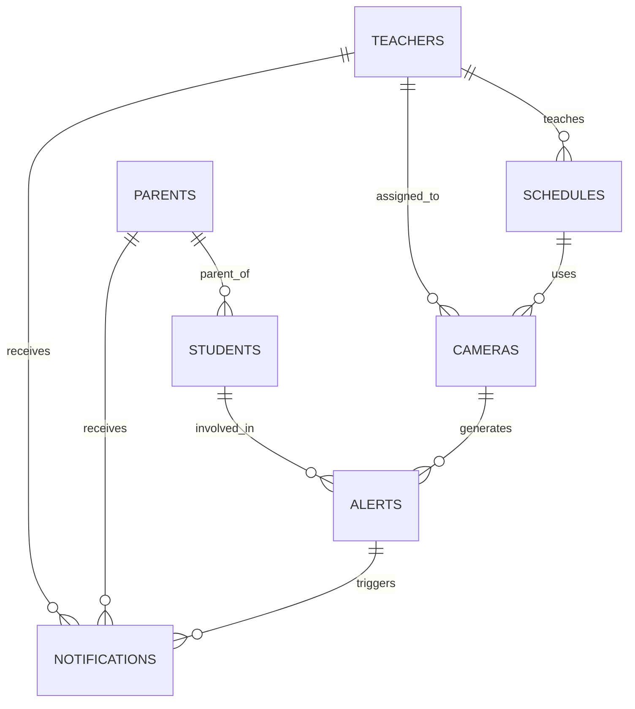

# Database Schema

This document describes the ClassGuard database schema, including entity relationships, table definitions, column constraints, and indexes.

---

## Table of Contents

- [Entity-Relationship Diagram](#entity-relationship-diagram)
- [Table Definitions](#table-definitions)
  - [students](#students)
  - [teachers](#teachers)
  - [parents](#parents)
  - [cameras](#cameras)
  - [alerts](#alerts)
  - [schedules](#schedules)
  - [notifications](#notifications)
- [Relationships](#relationships)
- [Indexes](#indexes)

---

## Entity-Relationship Diagram

---

## Table Definitions

### students

Represents students enrolled in the school. Used for identification in detection events and linking to parent notifications.

| Column       | Type         | Constraints                         | Description                              |
| ------------ | ------------ | ----------------------------------- | ---------------------------------------- |
| id           | INTEGER      | PRIMARY KEY, AUTOINCREMENT          | Unique student identifier                |
| first_name   | VARCHAR(100) | NOT NULL                            | Student first name                       |
| last_name    | VARCHAR(100) | NOT NULL                            | Student last name                        |
| grade        | VARCHAR(10)  | NOT NULL                            | Grade or class level (e.g., "10-A")      |
| parent_id    | INTEGER      | FOREIGN KEY (parents.id), NULLABLE  | Reference to the student's parent        |
| photo_url    | VARCHAR(500) | NULLABLE                            | URL to the student's profile photo       |
| is_active    | BOOLEAN      | NOT NULL, DEFAULT TRUE              | Whether the student is currently enrolled|
| created_at   | DATETIME     | NOT NULL, DEFAULT CURRENT_TIMESTAMP | Record creation timestamp                |
| updated_at   | DATETIME     | NOT NULL, DEFAULT CURRENT_TIMESTAMP | Record last-update timestamp             |

---

### teachers

Represents teaching staff. Teachers authenticate to the system and are assigned to cameras and schedules.

| Column        | Type         | Constraints                         | Description                               |
| ------------- | ------------ | ----------------------------------- | ----------------------------------------- |
| id            | INTEGER      | PRIMARY KEY, AUTOINCREMENT          | Unique teacher identifier                 |
| first_name    | VARCHAR(100) | NOT NULL                            | Teacher first name                        |
| last_name     | VARCHAR(100) | NOT NULL                            | Teacher last name                         |
| email         | VARCHAR(255) | NOT NULL, UNIQUE                    | Login email address                       |
| hashed_password | VARCHAR(255) | NOT NULL                          | bcrypt-hashed password                    |
| role          | VARCHAR(20)  | NOT NULL, DEFAULT 'teacher'         | Role: "teacher" or "principal"            |
| phone         | VARCHAR(20)  | NULLABLE                            | Contact phone number                      |
| is_active     | BOOLEAN      | NOT NULL, DEFAULT TRUE              | Whether the account is active             |
| created_at    | DATETIME     | NOT NULL, DEFAULT CURRENT_TIMESTAMP | Record creation timestamp                 |
| updated_at    | DATETIME     | NOT NULL, DEFAULT CURRENT_TIMESTAMP | Record last-update timestamp              |

---

### parents

Represents parents or guardians. Parents receive notifications for alerts involving their children.

| Column        | Type         | Constraints                         | Description                               |
| ------------- | ------------ | ----------------------------------- | ----------------------------------------- |
| id            | INTEGER      | PRIMARY KEY, AUTOINCREMENT          | Unique parent identifier                  |
| first_name    | VARCHAR(100) | NOT NULL                            | Parent first name                         |
| last_name     | VARCHAR(100) | NOT NULL                            | Parent last name                          |
| email         | VARCHAR(255) | NOT NULL, UNIQUE                    | Contact email address                     |
| hashed_password | VARCHAR(255) | NOT NULL                          | bcrypt-hashed password                    |
| phone         | VARCHAR(20)  | NULLABLE                            | Contact phone number for SMS alerts       |
| notify_email  | BOOLEAN      | NOT NULL, DEFAULT TRUE              | Opt-in for email notifications            |
| notify_sms    | BOOLEAN      | NOT NULL, DEFAULT FALSE             | Opt-in for SMS notifications              |
| notify_push   | BOOLEAN      | NOT NULL, DEFAULT FALSE             | Opt-in for push notifications             |
| fcm_token     | VARCHAR(500) | NULLABLE                            | Firebase Cloud Messaging device token     |
| is_active     | BOOLEAN      | NOT NULL, DEFAULT TRUE              | Whether the account is active             |
| created_at    | DATETIME     | NOT NULL, DEFAULT CURRENT_TIMESTAMP | Record creation timestamp                 |
| updated_at    | DATETIME     | NOT NULL, DEFAULT CURRENT_TIMESTAMP | Record last-update timestamp              |

---

### cameras

Represents surveillance cameras installed across the school campus. Each camera has a stream URL and is assigned to a teacher.

| Column        | Type         | Constraints                         | Description                               |
| ------------- | ------------ | ----------------------------------- | ----------------------------------------- |
| id            | INTEGER      | PRIMARY KEY, AUTOINCREMENT          | Unique camera identifier                  |
| name          | VARCHAR(100) | NOT NULL                            | Friendly name (e.g., "Main Entrance")     |
| location      | VARCHAR(200) | NOT NULL                            | Physical location description             |
| stream_url    | VARCHAR(500) | NOT NULL                            | RTSP or HTTP stream URL                   |
| teacher_id    | INTEGER      | FOREIGN KEY (teachers.id), NULLABLE | Teacher assigned to monitor this camera   |
| is_active     | BOOLEAN      | NOT NULL, DEFAULT TRUE              | Whether the camera is currently online     |
| confidence_threshold | FLOAT | NOT NULL, DEFAULT 0.5              | Minimum detection confidence (0.0 - 1.0)  |
| zone_type     | VARCHAR(50)  | NOT NULL, DEFAULT 'general'         | Zone classification: general, restricted, entrance |
| created_at    | DATETIME     | NOT NULL, DEFAULT CURRENT_TIMESTAMP | Record creation timestamp                 |
| updated_at    | DATETIME     | NOT NULL, DEFAULT CURRENT_TIMESTAMP | Record last-update timestamp              |

---

### alerts

Represents security alerts generated by the detection engine. Each alert is linked to a camera and optionally to a student.

| Column        | Type         | Constraints                         | Description                               |
| ------------- | ------------ | ----------------------------------- | ----------------------------------------- |
| id            | INTEGER      | PRIMARY KEY, AUTOINCREMENT          | Unique alert identifier                   |
| camera_id     | INTEGER      | FOREIGN KEY (cameras.id), NOT NULL  | Camera that generated the alert           |
| student_id    | INTEGER      | FOREIGN KEY (students.id), NULLABLE | Student involved (if identified)          |
| alert_type    | VARCHAR(50)  | NOT NULL                            | Type: intrusion, loitering, crowd, fight, unknown |
| severity      | VARCHAR(20)  | NOT NULL                            | Level: low, medium, high, critical        |
| description   | TEXT         | NULLABLE                            | Human-readable description of the event   |
| snapshot_url  | VARCHAR(500) | NULLABLE                            | URL to the captured snapshot in S3/MinIO  |
| confidence    | FLOAT        | NOT NULL                            | Detection confidence score (0.0 - 1.0)    |
| status        | VARCHAR(20)  | NOT NULL, DEFAULT 'pending'         | Status: pending, acknowledged, resolved, dismissed |
| acknowledged_by | INTEGER    | FOREIGN KEY (teachers.id), NULLABLE | Teacher who acknowledged the alert        |
| acknowledged_at | DATETIME   | NULLABLE                            | Timestamp when the alert was acknowledged |
| resolved_at   | DATETIME     | NULLABLE                            | Timestamp when the alert was resolved     |
| metadata      | JSON         | NULLABLE                            | Additional detection metadata (bounding boxes, etc.) |
| created_at    | DATETIME     | NOT NULL, DEFAULT CURRENT_TIMESTAMP | Record creation timestamp                 |
| updated_at    | DATETIME     | NOT NULL, DEFAULT CURRENT_TIMESTAMP | Record last-update timestamp              |

---

### schedules

Represents class schedules. Used by the detection engine for context-aware alerting (distinguishing expected vs. unexpected activity).

| Column        | Type         | Constraints                         | Description                               |
| ------------- | ------------ | ----------------------------------- | ----------------------------------------- |
| id            | INTEGER      | PRIMARY KEY, AUTOINCREMENT          | Unique schedule identifier                |
| teacher_id    | INTEGER      | FOREIGN KEY (teachers.id), NOT NULL | Teacher assigned to this class            |
| camera_id     | INTEGER      | FOREIGN KEY (cameras.id), NULLABLE  | Camera covering the classroom             |
| subject       | VARCHAR(100) | NOT NULL                            | Subject name (e.g., "Mathematics")        |
| grade         | VARCHAR(10)  | NOT NULL                            | Grade or section (e.g., "10-A")           |
| day_of_week   | INTEGER      | NOT NULL                            | Day of week (0 = Monday, 6 = Sunday)      |
| start_time    | TIME         | NOT NULL                            | Class start time                          |
| end_time      | TIME         | NOT NULL                            | Class end time                            |
| room          | VARCHAR(50)  | NULLABLE                            | Room number or name                       |
| is_active     | BOOLEAN      | NOT NULL, DEFAULT TRUE              | Whether this schedule entry is active     |
| created_at    | DATETIME     | NOT NULL, DEFAULT CURRENT_TIMESTAMP | Record creation timestamp                 |
| updated_at    | DATETIME     | NOT NULL, DEFAULT CURRENT_TIMESTAMP | Record last-update timestamp              |

---

### notifications

Represents notification records dispatched to teachers and parents. Used for audit logging and delivery tracking.

| Column        | Type         | Constraints                         | Description                               |
| ------------- | ------------ | ----------------------------------- | ----------------------------------------- |
| id            | INTEGER      | PRIMARY KEY, AUTOINCREMENT          | Unique notification identifier            |
| alert_id      | INTEGER      | FOREIGN KEY (alerts.id), NOT NULL   | Alert that triggered this notification    |
| teacher_id    | INTEGER      | FOREIGN KEY (teachers.id), NULLABLE | Teacher recipient (if applicable)         |
| parent_id     | INTEGER      | FOREIGN KEY (parents.id), NULLABLE  | Parent recipient (if applicable)          |
| channel       | VARCHAR(20)  | NOT NULL                            | Delivery channel: in_app, email, sms, push|
| title         | VARCHAR(200) | NOT NULL                            | Notification title                        |
| body          | TEXT         | NOT NULL                            | Notification body content                 |
| status        | VARCHAR(20)  | NOT NULL, DEFAULT 'pending'         | Delivery status: pending, sent, failed, read |
| sent_at       | DATETIME     | NULLABLE                            | Timestamp when the notification was sent  |
| read_at       | DATETIME     | NULLABLE                            | Timestamp when the notification was read  |
| error_message | TEXT         | NULLABLE                            | Error details if delivery failed          |
| created_at    | DATETIME     | NOT NULL, DEFAULT CURRENT_TIMESTAMP | Record creation timestamp                 |

---

## Relationships

| Relationship               | Type         | Description                                                       |
| -------------------------- | ------------ | ----------------------------------------------------------------- |
| parents -> students        | One-to-Many  | A parent can have multiple students enrolled                      |
| teachers -> cameras        | One-to-Many  | A teacher can be assigned to monitor multiple cameras              |
| teachers -> schedules      | One-to-Many  | A teacher can have multiple class schedule entries                 |
| cameras -> alerts          | One-to-Many  | A camera can generate multiple alerts over time                   |
| students -> alerts         | One-to-Many  | A student can be involved in multiple alerts                      |
| alerts -> notifications    | One-to-Many  | A single alert can trigger notifications across multiple channels |
| teachers -> notifications  | One-to-Many  | A teacher can receive multiple notifications                      |
| parents -> notifications   | One-to-Many  | A parent can receive multiple notifications                       |
| schedules -> cameras       | Many-to-One  | A schedule entry is optionally linked to a camera covering the room |
| alerts -> teachers (ack)   | Many-to-One  | An alert can be acknowledged by one teacher                       |

---

## Indexes

The following indexes are created to optimize common query patterns:

| Table          | Index Name                     | Columns                    | Purpose                                          |
| -------------- | ------------------------------ | -------------------------- | ------------------------------------------------- |
| students       | ix_students_parent_id          | parent_id                  | Fast lookup of children by parent                 |
| students       | ix_students_grade              | grade                      | Filter students by grade                          |
| teachers       | ix_teachers_email              | email (UNIQUE)             | Login lookups                                     |
| parents        | ix_parents_email               | email (UNIQUE)             | Login lookups                                     |
| cameras        | ix_cameras_teacher_id          | teacher_id                 | Find cameras assigned to a teacher                |
| alerts         | ix_alerts_camera_id            | camera_id                  | List alerts per camera                            |
| alerts         | ix_alerts_student_id           | student_id                 | List alerts involving a student                   |
| alerts         | ix_alerts_status               | status                     | Filter alerts by status (pending, acknowledged)   |
| alerts         | ix_alerts_severity             | severity                   | Filter alerts by severity level                   |
| alerts         | ix_alerts_created_at           | created_at                 | Sort and paginate alerts chronologically          |
| schedules      | ix_schedules_teacher_id        | teacher_id                 | Find schedules for a teacher                      |
| schedules      | ix_schedules_day_time          | day_of_week, start_time    | Lookup current schedule during detection          |
| notifications  | ix_notifications_alert_id      | alert_id                   | Find all notifications for an alert               |
| notifications  | ix_notifications_teacher_id    | teacher_id                 | List notifications for a teacher                  |
| notifications  | ix_notifications_parent_id     | parent_id                  | List notifications for a parent                   |
| notifications  | ix_notifications_status        | status                     | Filter by delivery status                         |
